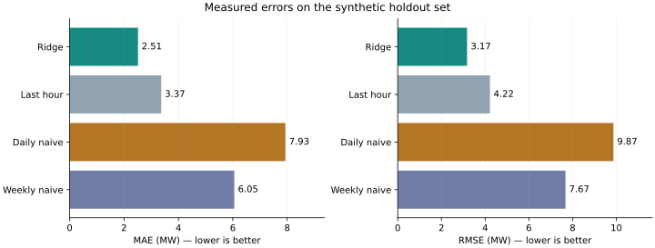
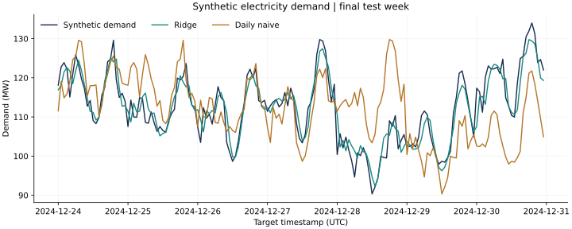

# Energy Demand Forecasting Demo

A small, reproducible Python example of **one-hour-ahead electricity-demand
forecasting on synthetic data**. It compares a regularised linear model with
last-hour, daily and weekly naive baselines.

> Portfolio learning project created with OpenAI Codex assistance in September
> 2026. The observations are invented. Reported errors are computed by the code,
> not fabricated scores, real Danish market results or previous client work.

## What it demonstrates

- Lagged demand, past temperature and known calendar features.
- Chronological train/validation/test separation with training-only scaling.
- Validation-based selection of Ridge regularisation.
- An untouched final test period with MAE/RMSE and complete prediction records.
- Tests that changing present/future observations cannot alter earlier features.
- Reproducible figures and transparent model limitations.

## Run locally

Tested with Python 3.12.14. Use Python 3.12 and an isolated environment:

```bash
python -m venv .venv
# Linux/macOS
source .venv/bin/activate
# Windows PowerShell: .venv\Scripts\Activate.ps1
python -m pip install -r requirements.txt
python forecast.py
python -m unittest discover -s tests -v
```

No API key, download, database or cloud account is required. The script generates
365 days of hourly observations using seed 42 and writes its results to `reports/`.
You can change `--seed`, `--days` and `--output`; changed inputs produce different
results and should be reported as separate experiments.

## Results

Read the [computed evaluation report](reports/evaluation.md), inspect the
[exact metrics](reports/metrics.json), or review the
[test predictions](reports/test_predictions.csv).





## Forecasting contract

For target hour **t**, the model assumes observations through **t−1** are available.
It uses only those past observations and the calendar for t. During the test
period, newly observed demand feeds later forecasts; model weights remain fixed.
This evaluates sequential **one-step-ahead** predictions. It does not evaluate a
24-hour forecast made all at once.

## Repository guide

| File | Purpose |
| --- | --- |
| `forecast.py` | Synthetic generator, features, model selection and reporting |
| `tests/test_forecast.py` | Temporal integrity and data validation checks |
| `reports/evaluation.md` | Generated results, methodology and caveats |
| `reports/metrics.json` | Exact scores, data hash and package versions |
| `reports/test_predictions.csv` | Every holdout target and model prediction |
| `reports/synthetic_data_sample.csv` | Small sample of invented observations |
| `reports/figures/` | Generated figures |
| `MODEL_CARD.md` | Intended use and limitations |

## Next steps for a real-data extension

Use a licensed electricity-demand dataset with documented publication times.
Evaluate several rolling origins, compare with stronger baselines, and account
for missing data, forecast-weather availability, holidays and operational latency.
Keep the real-data experiment separate from the synthetic benchmark.

## Provenance

Code, tests, documentation and plotting were generated with OpenAI Codex
assistance and executed in the task workspace. This repository is an educational
demonstration, not evidence of independent authorship, employment, production
deployment or validated trading performance. No private client data is included.
